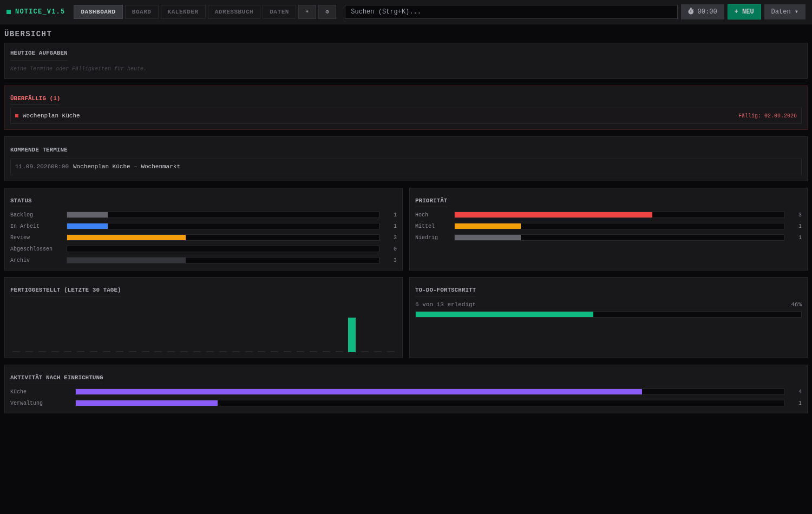
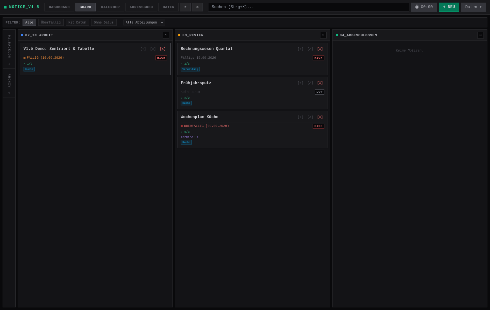
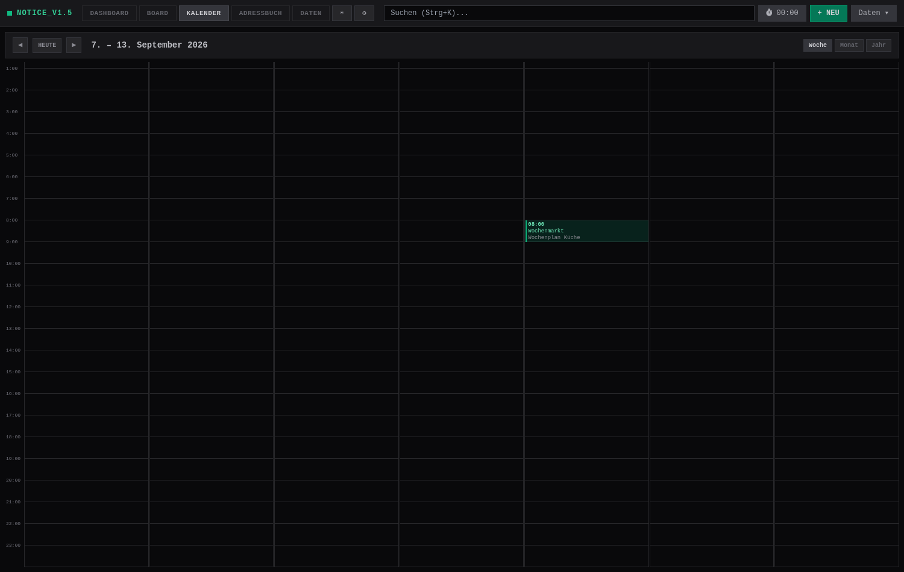
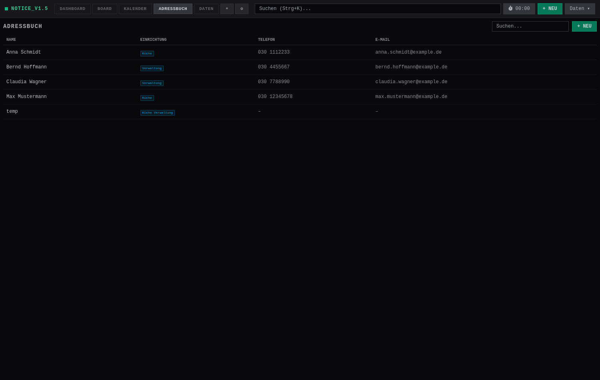
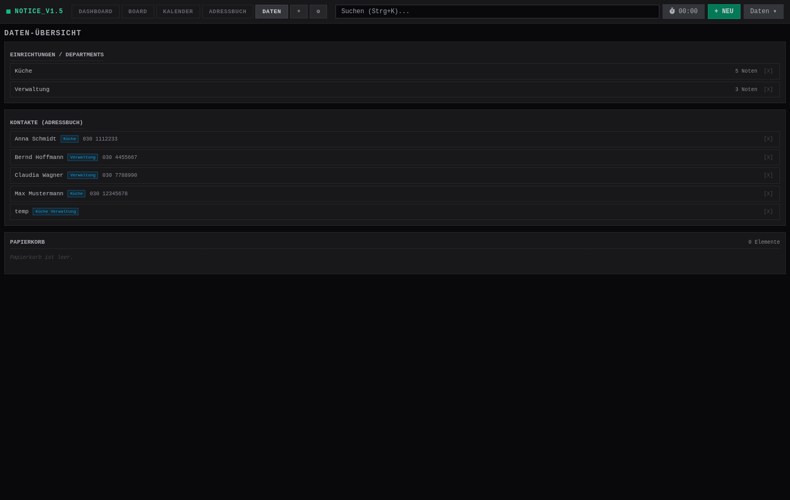
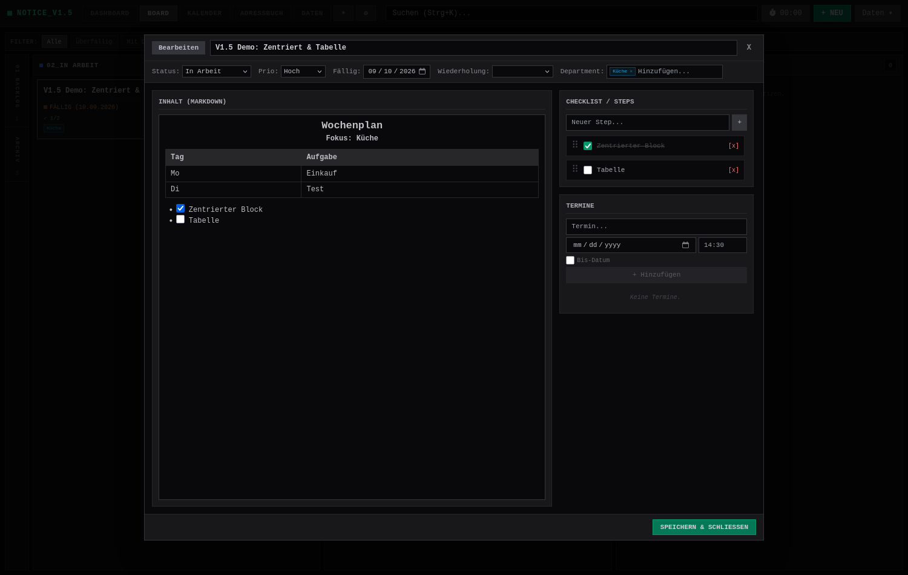

<p align="center">
  <b><span style="color:#34d399">■</span> NOTICE_V1.5</b> — <i>Pro Kanban Notes</i>
</p>

<p align="center">
  A compact, single-file Kanban notes board as a web app:<br/>
  an <b>Axum REST API (Rust)</b> serves an embedded <b>Vue 3 / Tailwind</b> UI and stores everything in a SQLite database. Backend, frontend HTML and JavaScript all live in a single file (<code>src/main.rs</code>).
</p>

---

## `// VIEWS` — Dashboard, Board, Calendar, Address book

Several views can be switched via the header bar (`DASHBOARD` / `BOARD` / `KALENDER` / `ADRESSBUCH` / `DATEN`). The first opened view is the **Dashboard**; afterwards the chosen view is remembered.



**Dashboard** – default start view with statistics: today's tasks and upcoming appointments, overdue items, status & priority distribution, completed activity over the last 30 days, to-do/checklist progress and activity by department.



**Board** – columns for `Backlog`, `In Progress`, `Review` and `Done`, plus a dedicated **collapsed** archive by default.



**Calendar** – Outlook-style view with `MONTH`, `WEEK` and `YEAR`. Cards with a due date appear as **blue** markers, booked **appointments** as **green**, overdue ones as **red**. Archived notes are hidden.



**Address book** (`contacts.db`) – full contact management with name, department, phone, e-mail and description. Searchable, and clicking a contact row opens an edit modal.



**Data overview** – central list of all departments (with note counts, deletable) and all contacts.



**Detail modal** (double-click a card) – title, status, priority, due date, departments, appointments and content/checklist editing with a preview mode.

---

## `// FEATURES`

- **Kanban board** with collapsible columns:
  - Collapsed statuses show as a **vertical tab stack on the left** (with a divider under each tab) – including the **archive**.
  - Expanded columns fill a grid in the middle.
- **Calendar** (`MONTH` / `WEEK` / `YEAR`) combines `due_date` (blue), appointments (green) and overdue (red).
- **New-note form** (`Alt+N`): title, status, priority, due date, content (Markdown), **checklist/steps** and **appointments**.
- **Detail modal** (double-click): all fields incl. **departments** and **appointments**, with an **edit/preview toggle**.
- **Markdown** for the content, incl. **supported HTML colors** and **cross-linked notes**: `[[Title|Display name]]` links other notes (with autocomplete), `{{Name|Alias}}` links **contacts** from the address book (with autocomplete). Clicking a note link opens that note; clicking an address link jumps to the address book and highlights the contact.
- **Markdown sanitization (V1.5)**: the rendered preview strips `<script>`, event handlers (`on*`), `javascript:`-URLs and other unsafe tags/attributes, so pasted HTML cannot execute code. Safe formatting (headings, tables, `hr`, images) is preserved.
- **Centered blocks (V1.5)**: wrap Markdown in `:::center` / `:::` to render it centered (e.g. `:::center\n**Mittig**\n:::`).
- **Image paste (V1.5)**: paste an image from the clipboard into a content editor – it is resized (max. 1200 px), converted to JPEG and embedded as `` Markdown.
- **Preview in the NEW-note form (V1.5)**: like the detail modal, the new-note dialog has a `Vorschau`/`Bearbeiten` toggle.
- **Trash auto-purge (V1.5)**: in the settings you can auto-delete trash entries older than N days on startup, or run it immediately ("JETZT AUFRÄUMEN").
- **Import preview (V1.5)**: before importing a backup, a preview modal shows the file name, mode (`Ersetzen`/`Zusammenführen`), counts of contained notes/contacts and the note titles – confirm with `Importieren` or decline with `Abbrechen`.
- **Undo (V1.5)**: destructive actions (create, duplicate, archive, delete, board drag & drop) offer a `Rückgängig` snackbar for ~10 seconds to revert the last action.
- **Dashboard** statistics overview (default view): today's tasks, overdue, upcoming appointments, status/priority distribution, completed activity chart, to-do progress and activity by department.
- **Address book** (`contacts.db`): full CRUD for contacts (name, department, phone, e-mail, description), searchable, department autocomplete reuses existing departments, seeded with sample contacts on first start.
- **Departments**: optional per note, freely creatable, **autocomplete** (most frequent first, case-insensitive deduplication). On cards the departments render as **inline wrapping badges** (single line, no emoji).
- **Data overview** (`DATEN`): central list of all **departments** (with note counts) and **contacts**. Deleting a department removes it from every note and contact.
- **Completed tracking**: notes store a `completed_at` date when moved to `done`/`archived` (cleared again when reactivated); it powers the Dashboard activity chart.
- **Appointments**: any number per note, with start, optional time (`HH:MM`), optional end date and end time.
- **Week view** is a 24-hour timeline with position/styleable event blocks; overlapping events are placed side by side in lanes; timed and all-day events are handled separately.
- **Drag & Drop** between columns as well as for reordering within a column; notes can be dragged directly into the **archive**.
- **Archive**: archive notes with `[A]`, restore with `[R]`, delete with `[X]`.
- **Priority and due-date badges** on the cards (`OVERDUE` and `DUE` respectively).
- **Overdue reminder**: on startup (and after changes) a floating panel lists overdue appointments and due dates.
- **Auto-archive**: optional (settings, default day = 1st), moves all `Done` notes to the archive on startup when that day is reached.
- **Export** as **JSON** or **CSV** via the export menu.
- **Dark/light theme**: dark by default, toggle in the header, persists in `localStorage`.
- **Full searchability** (`Ctrl+K`), incl. structured `key:value` syntax (see below).

---

## `// QUICKSTART`

### Prerequisites

- Rust (stable) incl. Cargo

### Build & Run

```bash
cargo build
cargo run
# → serves at http://127.0.0.1:8080
```

On first start, `notice.db` (SQLite, notes) and `contacts.db` (SQLite, address book) are created automatically. Existing databases are migrated with `ALTER TABLE` (e.g. `departments`, `appointments`, `completed_at`), existing data is preserved.

---

## `// USAGE`

| Action | Input |
|---|---|
| Focus the search bar | `Ctrl+K` |
| Open a new note | `Alt+N` |
| Open a note in the detail modal | Double-click a card |
| Toggle edit / preview | Button `Edit` / `Preview` |
| Save (in the modal) | `Ctrl+S` |
| Escape | Closes the modal/form or autocomplete (removes the `[[` / `{{` remnant) |
| Link a note | `[[` in the content, then pick with `↑↓`/`Enter` |
| Link a contact | `{{` in the content, then pick with `↑↓`/`Enter` |

### Departments

- On focus the **most frequent** existing departments are suggested, filtered live as you type.
- Inputs are **case-insensitively deduplicated** ("küche" becomes "Küche").
- Departments render as badges on the cards.

### Appointments

- In form and modal you can create appointments with `Start`, optional `Time` (`HH:MM`), optional `End` (date) and `End time`.
- Appointments appear as **green** calendar entries and in the card/modal list under "Appointments".

### Address book / Contacts

- Contacts live in a separate `contacts.db` database and are managed in the **ADRESSBUCH** view (`+ NEU` to add, click a row to edit, `[X]` to delete).
- Each contact has a name, an optional department (with the same autocomplete as notes), phone, e-mail and description.
- From within any note content you can link a contact with `{{Name}}` or `{{Name|Alias}}` – the rendered preview is clickable and jumps to the address book, highlighting the contact.
- The `DATEN` view also lists all contacts and lets you delete them.

---

## `// SEARCH SYNTAX`

The search covers e.g. title, content and departments. It additionally supports `key:value` filters:

```
status:done
status:in_progress          # or: inprogress / in arbeit
prio:high                   # or: priority:hoch / h
datum:2026-09-01            # or datum today / none / any / this_week
faellig:overdue             # or due / due_date
faellig:>=2026-09-01
faellig:2026-09-01..2026-09-30
dep:Küche
titel:Part-of-title
inhalt:Keyword
```

Multiple free-text terms are AND-ed together.

---

## `// API`

### Notes

| Method | Path | Description |
|---|---|---|
| `GET` | `/api/notes` | All notes (sorted by `sort_order`) |
| `POST` | `/api/notes` | Create a new note |
| `POST` / `PUT` | `/api/notes/:id` | Update a note (both intentionally mapped) |
| `DELETE` | `/api/notes/:id` | Delete a note |
| `GET` | `/api/notes/search?q=…` | Search for the `[[` autocomplete |
| `POST` | `/api/notes/:id/duplicate` | Duplicate a note (title gets a `(copy)` suffix) |

Example `POST /api/notes`:

```json
{
  "title": "Einkauf",
  "content": "{\"text\": \"Milch\", \"checklist\": []}",
  "status": "backlog",
  "priority": "medium",
  "due_date": "2026-09-30",
  "departments": "[\"Küche\"]",
  "appointments": "[{\"title\": \"Markt\", \"start\": \"2026-09-30\", \"time\": \"14:30\"}]"
}
```

> **Note:** `content` stores **JSON** (`{"text": …, "checklist": […]}`), not plain text. Likewise `departments` and `appointments` are **JSON-array strings** – never send raw strings/objects, always `JSON.stringify(...)` from the JS.

### Departments

| Method | Path | Description |
|---|---|---|
| `GET` | `/api/departments` | `[{name, count}]`, sorted by frequency, case-insensitively deduplicated |
| `POST` | `/api/departments/delete` | Body `{"name": …}` – deletes a department and removes it from every note and contact |

### Contacts

| Method | Path | Description |
|---|---|---|
| `GET` | `/api/contacts` | All contacts |
| `POST` | `/api/contacts` | Create a contact |
| `PUT` / `DELETE` | `/api/contacts/:id` | Update / delete a contact |
| `GET` | `/api/contacts/search?q=…` | Search for the `{{` autocomplete |

---

## `// DATA MODEL`

Table `notes`:

| Column | Type | Meaning |
|---|---|---|
| `id` | INTEGER (PK) | Auto ID |
| `title` | TEXT | Title |
| `content` | TEXT | Content as JSON (`text` + `checklist`) |
| `status` | TEXT | `backlog`, `in_progress`, `review`, `done`, `archived` |
| `priority` | TEXT | `low`, `medium`, `high` |
| `date` | TEXT | Creation date (DD.MM.YYYY) |
| `due_date` | TEXT | Optional due date (YYYY-MM-DD) |
| `department` | TEXT | Legacy: single department (compatibility) |
| `departments` | TEXT | JSON array of departments |
| `appointments` | TEXT | JSON array of appointments |
| `sort_order` | INTEGER | Sort order within a column |
| `completed_at` | TEXT | Date (YYYY-MM-DD) the note was moved to `done`/`archived` (null when active) |
| `deleted_at` | TEXT | Timestamp (`YYYY-MM-DD HH:MM:SS`) when the note was soft-deleted; basis for the trash and its auto-purge |

Table `contacts` (in `contacts.db`):

| Column | Type | Meaning |
|---|---|---|
| `id` | INTEGER (PK) | Auto ID |
| `name` | TEXT | Full name |
| `department` | TEXT | Optional department |
| `phone` | TEXT | Optional phone number |
| `email` | TEXT | Optional e-mail address |
| `description` | TEXT | Optional notes |

---

## `// PROJECT STRUCTURE`

- `src/main.rs` – the whole app (Rust backend, database setup, embedded HTML/JS frontend).
- `notice.db` – SQLite database for notes, created at runtime (in `.gitignore`).
- `contacts.db` – SQLite database for the address book, created at runtime (in `.gitignore`).
- `screenshots/` – screenshots of the UI (dashboard, board, calendar, address book, data, detail modal).
- `AGENTS.md` – extra notes for development assistants.

---

## `// TECHNICAL NOTES`

- `sqlx` connects via `sqlite://notice.db?mode=rwc`; `?mode=rwc` creates the file when needed.
- The SQL queries are runtime strings (no `sqlx::query!` macros) – no compile-time SQL checks.
- The frontend libraries (Vue production, Tailwind, marked) are **embedded locally** (offline-capable) instead of a CDN.
- The whole UI and all texts are in **German**.
- No test/lint/CI setup; verified via `cargo build` + manual smoke test.
