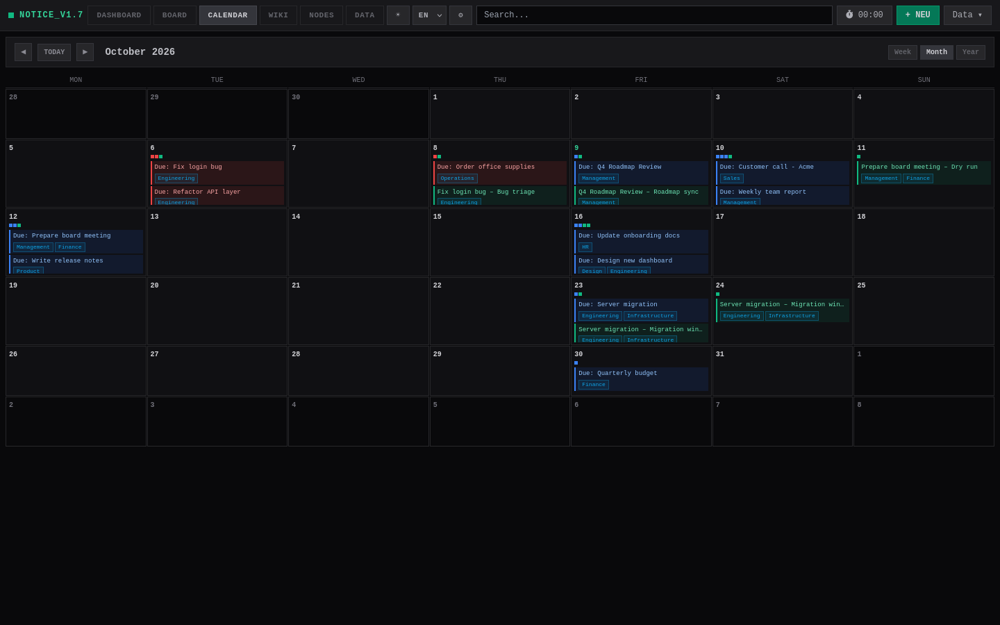
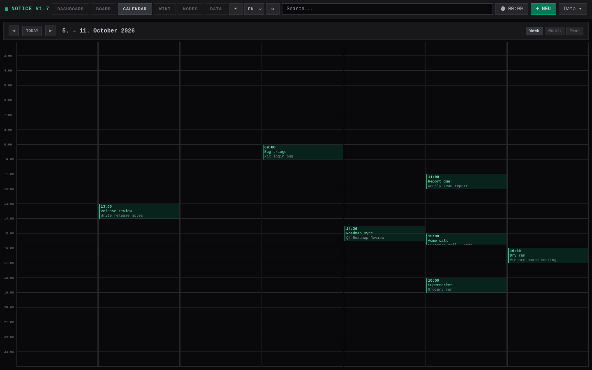
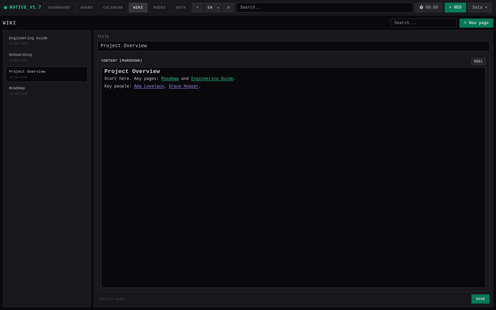
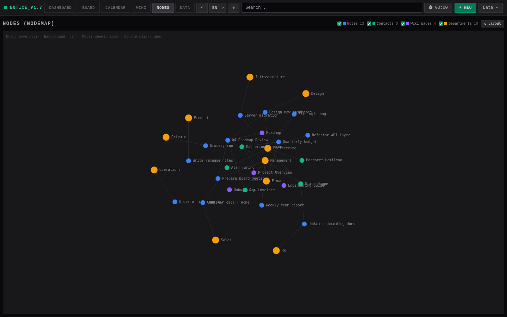
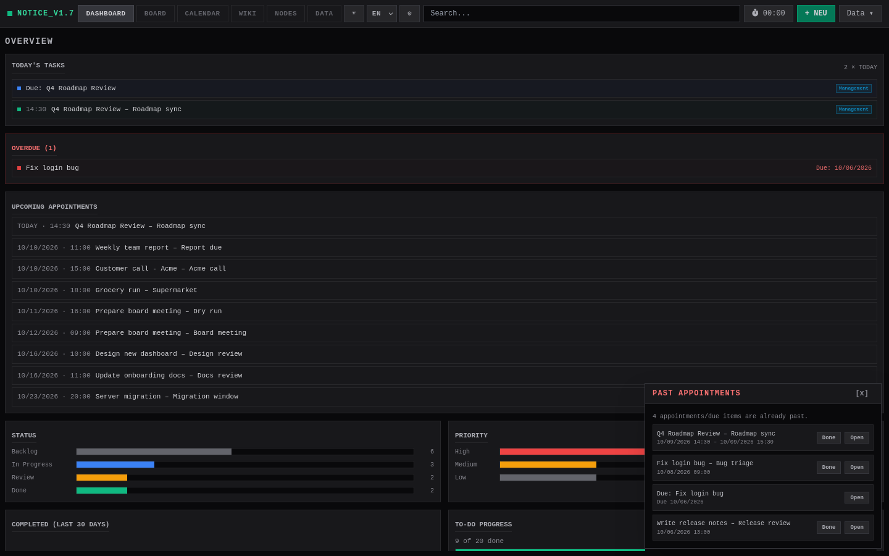
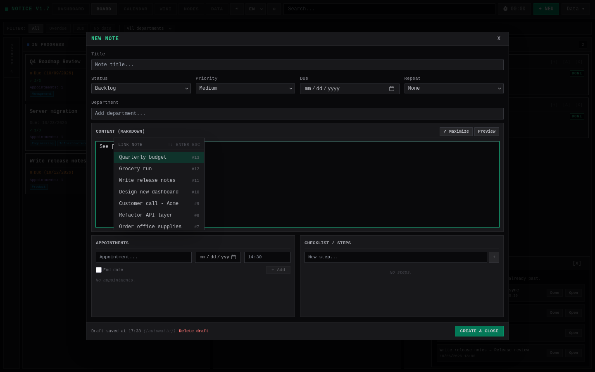
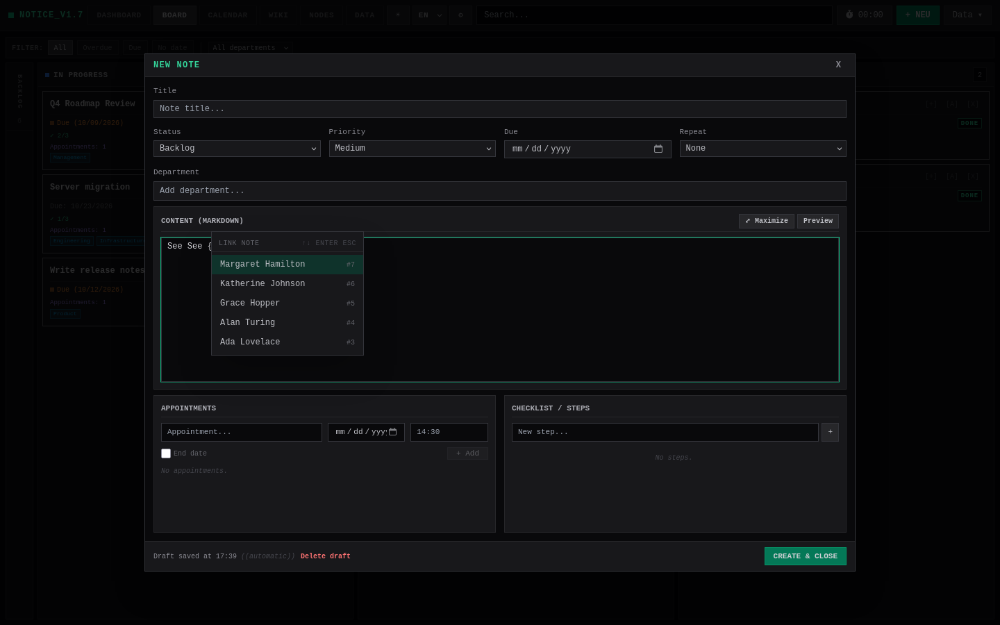
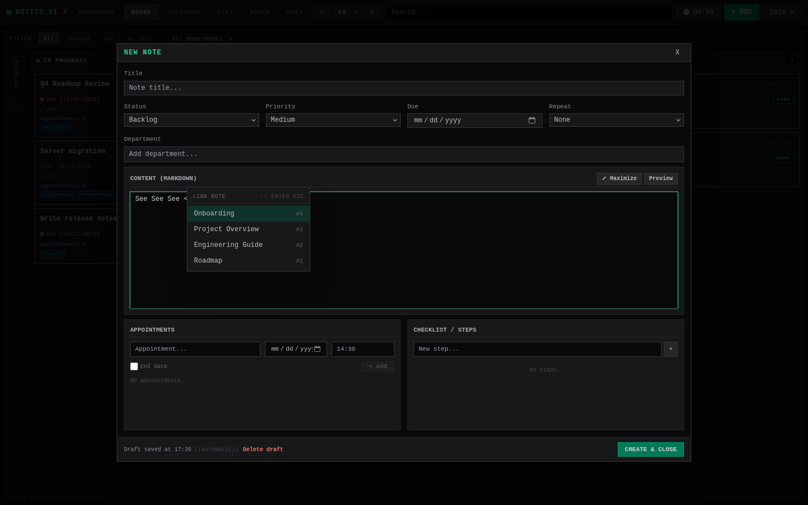
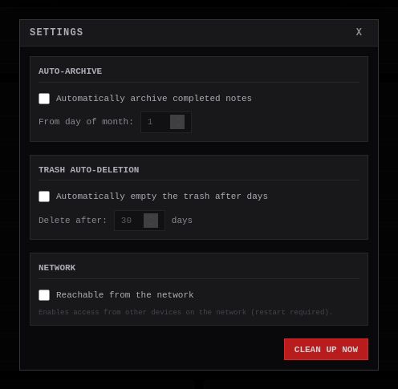

<p align="center">
  <b><span style="color:#34d399">■</span> NOTICE v1.7.0</b> — <i>Kanban Notes, Wiki &amp; Knowledge Graph</i>
</p>

<p align="center">
  A compact, offline-first notes workspace as a self-contained web app:<br/>
  an <b>Axum REST API (Rust)</b> serves an embedded <b>Vue 3 / Tailwind</b> UI and stores
  everything in <b>three SQLite databases</b> (notes + wiki, contacts, archive).
</p>

---

> [!CAUTION]
> **Work in Progress (WIP)**
>
> This project is in an early development stage. Features may change drastically, break
> unexpectedly, or remain incomplete. Use with caution!
>
> **The entire codebase — backend, frontend and this documentation — is 100% AI-generated.**

---

## `// VIEWS` — Dashboard, Board, Calendar, Wiki, Nodes, Data

Views are switched from the header bar (`DASHBOARD` / `BOARD` / `CALENDAR` / `WIKI` /
`NODES` / `DATA`). The first view is the **Dashboard**; the last selected view is remembered.


**Dashboard** – default start view with statistics: today's tasks and upcoming
appointments, overdue items, status & priority distribution, completed activity over the
last 30 days, checklist progress and activity by department.


**Board** – four collapsible Kanban columns (`Backlog`, `In Progress`, `Review`, `Done`)
with drag & drop, quick filters (`All` / `Overdue` / `Due` / `No date`), priority and
due-date badges, and archive/restore/delete actions per card. The archive is **not** a
board column — archived notes live in the **Data** view.



**Calendar** – `MONTH`, `WEEK` and `YEAR` views. Due dates appear as **blue** markers,
booked **appointments** as **green**, and overdue entries as **red**. Archived notes are hidden.



The **week view** is a 24-hour timeline with positioned event blocks; overlapping events
are laid out side by side, and timed and all-day events are handled separately.



**Wiki** – a page list (with filter) plus a Markdown editor with an edit/preview toggle.
Pages can link notes (`[[`), contacts (`{{`) and other wiki pages (`<<`), and can be
created, edited and deleted.



**Nodes** – an interactive, force-directed knowledge graph rendered on a canvas. It plots
**notes**, **contacts**, **wiki pages** and **departments** as nodes and visualizes the
links between them. Node types can be toggled, the layout recalculated, and selecting a
node shows its properties and neighbors; double-clicking opens the underlying item.


**Data** – central management view: all **departments** (with note counts, create/delete),
the full **contacts** table (search, CRUD), the **archive** (restore / delete forever) and
the **trash** for soft-deleted notes and contacts (restore / empty).


**Detail modal** (double-click a card) – title, status, priority, due date, recurrence,
departments, appointments and content/checklist editing with an edit/preview toggle.



**Overdue reminder** – a floating panel that lists past appointments and overdue due
dates; entries can be completed or opened directly.







**Link autocomplete** – typing `[[`, `{{` or `<<` in any editor opens a keyboard-driven
suggestion list (`↑` `↓` `Enter` `Esc`) for notes, contacts and wiki pages respectively.



**Settings** – auto-archive of completed notes, trash auto-purge, network access toggle,
language and theme.

---

## `// FEATURES`

- **Kanban board** with four collapsible columns (`Backlog`, `In Progress`, `Review`,
  `Done`), drag & drop between columns and for reordering, and quick filters.
- **Calendar** (`MONTH` / `WEEK` / `YEAR`) combining due dates (blue), appointments
  (green) and overdue entries (red).
- **Wiki** (`wiki` table) with a Markdown editor, live preview and cross-links.
- **Nodes** – a force-directed graph over notes, contacts, wiki pages and departments,
  with per-type filters, layout recalculation and a details panel.
- **Dashboard** statistics: today's tasks, overdue, upcoming appointments,
  status/priority distribution, a completed-activity chart, checklist progress and
  activity by department.
- **New-note form** (`Alt+N`): title, status, priority, due date, **recurrence**, Markdown
  content, a **checklist/steps** list, **departments** and **appointments**.
- **Detail modal** (double-click): all fields including departments and appointments,
  with an **edit/preview toggle**.
- **Recurrence** (`daily` / `weekly` / `monthly`): completing a recurring note advances its
  due date and appointment dates to the next occurrence and returns it to the backlog.
- **Markdown content** with **supported HTML colors** and cross-links:
  `[[Title|Display name]]` links notes, `{{Name|Alias}}` links contacts, and
  `<<Wiki page>>` links wiki pages — each with autocomplete. Clicking a link opens the
  target; contact links jump to the contact and highlight it.
- **Markdown sanitization**: the rendered preview strips `<script>`, event handlers
  (`on*`), `javascript:` URLs and other unsafe tags/attributes, while preserving safe
  formatting (headings, tables, `hr`, images).
- **Centered blocks**: wrap Markdown in `:::center` / `:::` to render it centered.
- **Image paste / upload**: paste or insert an image into a content editor — it is
  resized (max. 1200 px), converted to JPEG and embedded as ``.
- **Formatting context menu** (right-click in the editor): bold, italic, strike, code,
  HTML text colors and image insertion.
- **Preview** in both the new-note form and the detail modal.
- **Contacts** (separate `contacts.db`): full CRUD for name, title, departments, phone,
  mobile, fax, e-mail and description, searchable; seeded with sample contacts on first run.
- **Departments**: optional and multiple per note/contact, freely creatable, with
  **autocomplete** (most frequent first, case-insensitive deduplication). Rendered as
  inline wrapping badges on cards. Deleting a department removes it from every note and contact.
- **Appointments**: any number per note, with start date, optional time (`HH:MM`), and an
  optional end date plus end time.
- **Overdue reminder** panel listing past appointments and overdue due dates.
- **Trash** (soft delete) with restore and permanent delete, plus **auto-purge** of entries
  older than N days on startup (configurable, or run immediately from settings).
- **Archive**: notes are physically moved to a separate `archive.db`; restore or delete
  forever from the Data view.
- **Undo**: destructive actions (create, duplicate, archive, delete, board drag & drop)
  offer an `Undo` snackbar for ~10 seconds.
- **Import / Export**: export as **JSON** or **CSV**, a full **JSON backup**, and import a
  backup in `merge` or `replace` mode — with a preview showing file name, mode, contained
  counts and note titles before confirming.
- **Built-in countdown timer** in the header.
- **Dark/light theme** (dark by default, persists in `localStorage`).
- **Internationalization**: German, English, Spanish and French (`frontend/i18n/*.json`).
- **Full-text search** (`Ctrl+K`) with structured `key:value` syntax (see below).
- **Offline-capable**: all frontend libraries are embedded locally (no CDN).

---

## `// QUICKSTART`

### Prerequisites

- Rust (stable) including Cargo

### Build & Run

```bash
cargo build
cargo run
# → serves at http://127.0.0.1:8080
```

- `--port <u16>` overrides the configured port (used by the Android wrapper).
- `--config <path>` uses an alternative config file (default `config.toml`).

On first start, `config.toml` is written with defaults and the three databases
`notice.db`, `contacts.db` and `archive.db` are created automatically. Existing databases
are migrated idempotently with `ALTER TABLE` (e.g. `departments`, `appointments`,
`completed_at`, `repeat_rule`, `pinned`); existing data is preserved. A consistent
snapshot of each database is written to `backups/` on every startup using `VACUUM INTO`
(rolling window, `backup_keep`).

---

## `// USAGE`

| Action | Input |
|---|---|
| Focus the search bar | `Ctrl+K` |
| Open a new note | `Alt+N` (or `N` when not typing) |
| Open a note in the detail modal | Double-click a card |
| Toggle edit / preview | Button `Edit` / `Preview` |
| Save (in the modal) | `Ctrl+S` |
| Show shortcut help | `?` |
| Close modal / form / autocomplete | `Esc` (also removes the `[[` / `{{` / `<<` remnant) |
| Link a note | `[[` in the content, then pick with `↑` `↓` / `Enter` |
| Link a contact | `{{` in the content, then pick with `↑` `↓` / `Enter` |
| Link a wiki page | `<<` in the content, then pick with `↑` `↓` / `Enter` |

### Departments

- On focus the **most frequent** existing departments are suggested and filtered live as you type.
- Inputs are **case-insensitively deduplicated** (an existing "Kitchen" is reused for "kitchen").
- Departments render as badges on the cards and in the contacts table.

### Appointments

- In the form and modal you can create appointments with `Start`, optional `Time`
  (`HH:MM`), optional `End` (date) and `End time`.
- Appointments appear as **green** calendar entries and in the card/modal list under "Appointments".

### Contacts

- Contacts live in a separate `contacts.db` database and are managed in the **Data** view
  (`+ NEW` to add, click a row to edit, `[X]` to delete).
- Each contact has a name, an optional title, departments (with the same autocomplete as
  notes), phone, mobile, fax, e-mail and description.
- From any note or wiki content you can link a contact with `{{Name}}` or `{{Name|Alias}}`
  — the rendered preview is clickable and highlights the contact in the Data view.

---

## `// SEARCH SYNTAX`

The search covers title, content and departments. It additionally supports `key:value`
filters (use the English keys):

```
status:done
status:in_progress
priority:high
priority:h
date:2026-09-01
date:today
date:none                 # no creation date
date:any
date:this_week
due:overdue
due:>=2026-09-01
due:2026-09-01..2026-09-30
department:Kitchen
title:Part-of-title
content:keyword
```

Multiple free-text terms are AND-ed together. Dates accept `YYYY-MM-DD` and `DD.MM.YYYY`.
Comparison operators (`>=`, `<=`, `>`, `<`) and ranges (`..`) are supported for date fields.

> Localized aliases for the **values** are also accepted (e.g. `priority:hoch`,
> `status:in_progress` → `inprogress`), but the **keys** are canonical English:
> `title`, `content`, `status`, `priority`, `date`, `due`, `department` (`dep`).

---

## `// API`

### Notes

| Method | Path | Description |
|---|---|---|
| `GET` | `/api/notes` | All active notes (excludes archived and trashed; sorted by `sort_order`) |
| `POST` | `/api/notes` | Create a new note |
| `POST` / `PUT` | `/api/notes/:id` | Update a note (both intentionally mapped to the same handler) |
| `DELETE` | `/api/notes/:id` | Soft-delete a note (moves it to the trash) |
| `POST` | `/api/notes/:id/restore` | Restore a trashed note |
| `DELETE` | `/api/notes/:id/force` | Permanently delete a trashed note |
| `POST` | `/api/notes/:id/duplicate` | Duplicate a note (a copy suffix is appended to the title) |
| `POST` | `/api/notes/:id/archive` | Move a note into the archive database |
| `GET` | `/api/notes/search?q=…` | Title search for the `[[` autocomplete |

Example `POST /api/notes`:

```json
{
  "title": "Groceries",
  "content": "{\"text\": \"Milk\", \"checklist\": []}",
  "status": "backlog",
  "priority": "medium",
  "due_date": "2026-09-30",
  "departments": "[\"Kitchen\"]",
  "appointments": "[{\"title\": \"Market\", \"start\": \"2026-09-30\", \"time\": \"14:30\"}]",
  "repeat_rule": "weekly"
}
```

> **Note:** `content` stores **JSON** (`{"text": …, "checklist": […]}`), not plain text.
> Likewise `departments` and `appointments` are **JSON-array strings** — never send raw
> strings/objects, always `JSON.stringify(...)` from the JS side.

### Wiki

| Method | Path | Description |
|---|---|---|
| `GET` | `/api/wiki` | All wiki pages |
| `POST` | `/api/wiki` | Create a wiki page |
| `PUT` / `DELETE` | `/api/wiki/:id` | Update / delete a wiki page |
| `GET` | `/api/wiki/search?q=…` | Search for the `<<` autocomplete |

### Departments

| Method | Path | Description |
|---|---|---|
| `GET` | `/api/departments` | `[{name, count}]`, sorted by frequency, case-insensitively deduplicated |
| `POST` | `/api/departments` | Create a department |
| `POST` | `/api/departments/delete` | Body `{"name": …}` – deletes a department and removes it from every note and contact |

### Contacts

| Method | Path | Description |
|---|---|---|
| `GET` | `/api/contacts` | All active contacts |
| `POST` | `/api/contacts` | Create a contact |
| `PUT` / `DELETE` | `/api/contacts/:id` | Update / soft-delete a contact |
| `POST` | `/api/contacts/:id/restore` | Restore a trashed contact |
| `DELETE` | `/api/contacts/:id/force` | Permanently delete a trashed contact |
| `GET` | `/api/contacts/search?q=…` | Search for the `{{` autocomplete |

### Trash / Archive

| Method | Path | Description |
|---|---|---|
| `GET` | `/api/trash` | All trashed notes and contacts |
| `POST` | `/api/trash/clear` | Empty the trash |
| `POST` | `/api/trash/purge` | Body `{"days": N}` – purge trash entries older than `N` days |
| `GET` | `/api/archive` | All archived notes (`archive.db`), newest first |
| `POST` | `/api/archive/:id/restore` | Move an archived note back into `notice.db` |
| `DELETE` | `/api/archive/:id` | Permanently delete an archived note |

### Import / Config

| Method | Path | Description |
|---|---|---|
| `POST` | `/api/import` | Import notes/contacts/wiki; body `{"mode": "merge" \| "replace", …}` |
| `GET` | `/api/config` | Current configuration plus `created_fresh` and `path` |
| `PUT` | `/api/config` | Deep-merge a JSON patch into the config and persist `config.toml` |

---

## `// DATA MODEL`

### `notes` (in `notice.db`)

| Column | Type | Meaning |
|---|---|---|
| `id` | INTEGER (PK) | Auto ID |
| `title` | TEXT | Title |
| `content` | TEXT | Content as JSON (`text` + `checklist`) |
| `status` | TEXT | `backlog`, `in_progress`, `review`, `done`, `archived` |
| `priority` | TEXT | `low`, `medium`, `high` |
| `date` | TEXT | Creation date (DD.MM.YYYY) |
| `due_date` | TEXT | Optional due date (YYYY-MM-DD) |
| `department` | TEXT | Legacy single department (compatibility; migrated into `departments`) |
| `departments` | TEXT | JSON array of departments |
| `appointments` | TEXT | JSON array of appointments |
| `sort_order` | INTEGER | Sort order within a column |
| `completed_at` | TEXT | `YYYY-MM-DD` when the note was moved to `done`/`archived` (null when active) |
| `deleted_at` | TEXT | Timestamp (`YYYY-MM-DD HH:MM:SS`) when soft-deleted; basis for the trash and its auto-purge |
| `repeat_rule` | TEXT | `daily`, `weekly`, `monthly` (null when not recurring) |
| `pinned` | INTEGER | Pin flag (stored; not yet surfaced in the UI) |

### `wiki` (in `notice.db`)

| Column | Type | Meaning |
|---|---|---|
| `id` | INTEGER (PK) | Auto ID |
| `title` | TEXT (UNIQUE) | Page title |
| `content` | TEXT | Markdown content |
| `created_at` | TEXT | Creation timestamp |
| `updated_at` | TEXT | Last update timestamp |

### `departments_store` (in `notice.db`)

| Column | Type | Meaning |
|---|---|---|
| `id` | INTEGER (PK) | Auto ID |
| `name` | TEXT (UNIQUE) | Department name (also derived from notes/contacts) |

### `contacts` (in `contacts.db`)

| Column | Type | Meaning |
|---|---|---|
| `id` | INTEGER (PK) | Auto ID |
| `name` | TEXT | Full name |
| `title` | TEXT | Optional title (e.g. academic) |
| `department` | TEXT | Legacy single department (compatibility) |
| `departments` | TEXT | JSON array of departments |
| `phone` | TEXT | Optional phone number |
| `mobile` | TEXT | Optional mobile number |
| `fax` | TEXT | Optional fax number |
| `email` | TEXT | Optional e-mail address |
| `description` | TEXT | Optional notes |
| `deleted_at` | TEXT | Soft-delete timestamp; basis for the trash and its auto-purge |

### `notes` (in `archive.db`)

The archive is a **separate database file** with the same column set as
`notes` (declared fully in `setup_archive`). Archived notes are physically moved there.

---

## `// CONFIGURATION` (`config.toml`)

Created automatically on first run and editable through the settings UI.

```toml
[server]
host = "127.0.0.1"      # 127.0.0.1 or 0.0.0.0
port = 8080

[database]
notice = "notice.db"
contacts = "contacts.db"
archive = "archive.db"
backup_dir = "backups"
backup_keep = 10        # number of snapshots kept per database

[app]
language = "de"         # de | en | es | fr
theme = "dark"          # dark | light
auto_archive_enabled = false
auto_archive_day = 1
trash_purge_enabled = false
trash_purge_day = 30
```

---

## `// PROJECT STRUCTURE`

- `src/` – modular Rust backend: `main.rs`, `config.rs`, `db.rs`, `models.rs`,
  `recurrence.rs`, `i18n.rs`, `frontend.rs`, and `api/*` (notes, wiki, departments,
  contacts, trash, archive, imports, config).
- `frontend/` – the frontend (Vue 3 + Tailwind + marked, all vendored): `index.html`
  (template with runtime placeholders), `app.js`, `vendor/`, and `i18n/*.json`
  (de / en / es / fr).
- `android/` – a native Android wrapper (WebView host for the Rust server) that builds an APK.
- `notice.db` / `contacts.db` / `archive.db` – SQLite databases, created at runtime (gitignored).
- `backups/` – startup snapshots of the databases (rolling window, gitignored).
- `config.toml` – configuration (language, theme, auto-archive, trash purge, server; gitignored).
- `screenshots/` – screenshots of the UI.
- `AGENTS.md` – extra notes for development assistants (gitignored).

---

## `// ANDROID APP (APK)`

`android/` contains a slim native wrapper of the web app: an Android activity with a
fullscreen WebView starts the cross-compiled Rust server (packaged as `libnotice.so`,
which is actually an executable ELF binary) via `ProcessBuilder` and then loads
`http://127.0.0.1:<free port>/`. Data (`config.toml`, `notice.db`, `contacts.db`,
`archive.db`, `backups/`) lives in the app-private directory (`filesDir`) and survives updates.

```bash
./build-apk.sh
# → android/app/build/outputs/apk/debug/app-debug.apk  (arm64-v8a)
```

Requirements: Android SDK + NDK (default `$HOME/android-sdk`), JDK 17–22, the Rust target
(`rustup target add aarch64-linux-android`) and `cargo-ndk`. The script locates/validates all
paths itself and downloads JDK 21 if no suitable JDK is present. See `android/README.md` for details.

---

## `// TECHNICAL NOTES`

- `sqlx` connects via `sqlite://<path>?mode=rwc`; `?mode=rwc` creates the file when needed.
- SQL statements are runtime strings (no `sqlx::query!` macros) — no compile-time SQL checks.
- The frontend libraries (Vue production, Tailwind, marked) are **embedded locally**
  (offline-capable) instead of loaded from a CDN.
- All frontend assets are embedded at **compile time** via `include_str!` in
  `src/frontend.rs`; editing anything under `frontend/` requires a rebuild.
- The UI is i18n-ready (de / en / es / fr, **German default**) via `frontend/i18n/*.json`,
  injected as `window.__I18N__`.
- There is no test suite, linter, formatter config or CI; verify with `cargo build` plus a
  manual browser smoke test.
